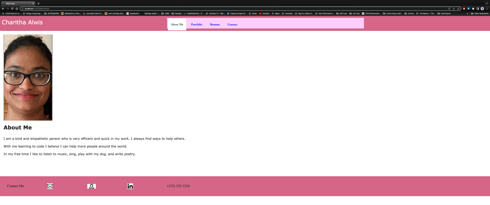
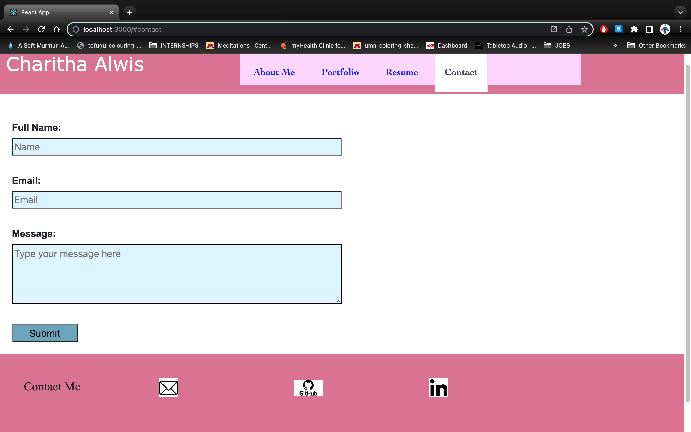
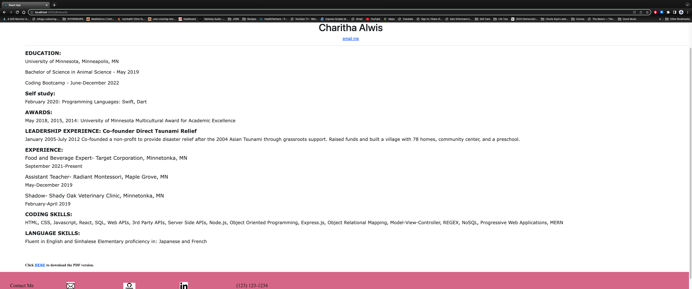
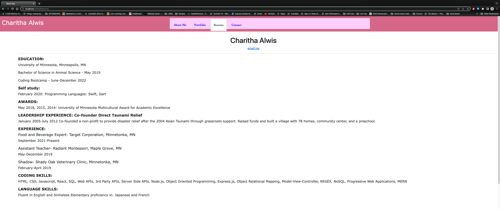
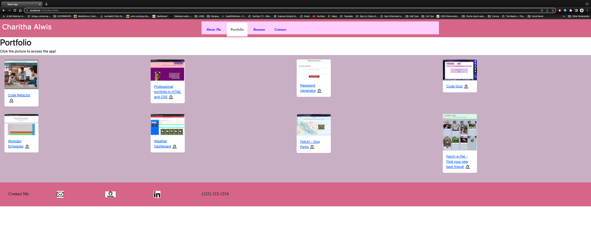

# Mod 20 React Portfolio

  

  ## Table of Contents
  * [Description](#description)
  * [Installation](#installation)
  * [Usage](#usage)
  * [Contributing](#contributing)
  * [Tests](#tests)
  * [Screenshots](#screenshots)
  * [Application link](#application)
  * [Github](#github)
  * [Email Address](#email)
  * [Licenses](#licenses)

  
  ## Description
  This is a REACT portfolio that is used as a central location for all of my projects. Here I can have an clean, nicly presentable, easy way to go back and access all my created projects in this course to show to potential employers.

  ## Installation
  npx create-react-app my-app to create the initial app, npm i bootstrap to get the bootstrap formatting, and the npm start to run the app, npm run build to optimize the build

  ## Usage
  go to the app on github pages
  ## Licenses
  This project is covered under the MIT license. Please click on the license button to get more info.
  
  ## Contributing
  add things as needed
  
  ## Tests
  npm test to run tests
  
  ## Screenshots
    
    
    
    
    
    
    
    
    

  ## Application
  https://github.com/DalPenny/mod20-react
  
  ## Github
  Have questions about this project?  
  GitHub: https://github.com/DalPenny  
  Email: dalpenny@github.io

